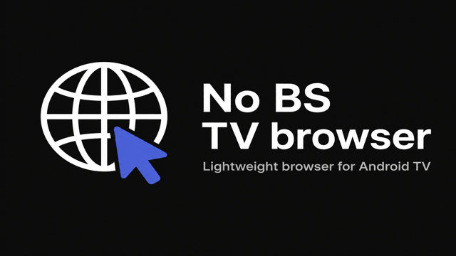
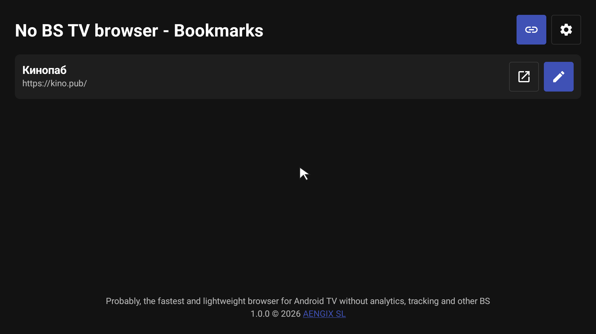
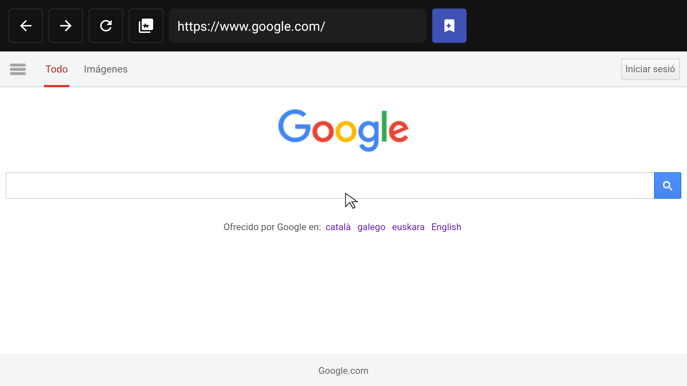
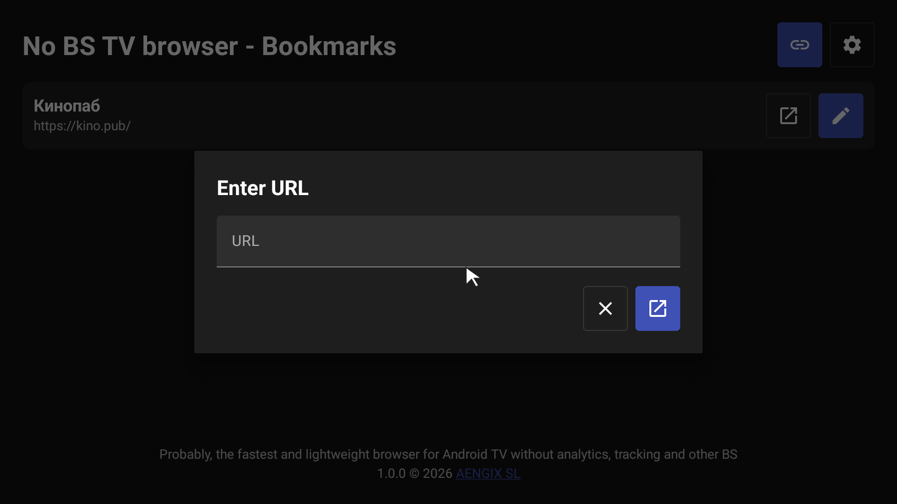
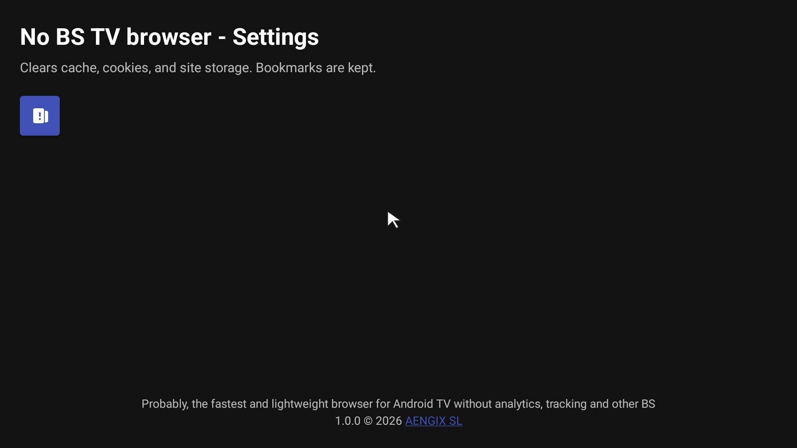

# No BS TV browser

<p align="center">
  
</p>

**No real BS.** A lightweight browser built for Android TV — fast, small, and free of analytics, tracking, and everything else you did not ask for.

Probably the fastest and lightest way to browse the web on your TV. No accounts, no telemetry, no bloat — just bookmarks, a URL bar, and a WebView that gets out of your way.

## Why No BS?

| | |
|---|---|
| **No real BS** | No sign-ups, no upsells, no dark patterns. Open a URL and browse. |
| **No analytics** | Zero usage tracking. Nothing phones home. |
| **No tracking** | No third-party trackers baked in. Your browsing stays yours. |
| **Lightning fast** | Minimal UI, hardware-accelerated WebView, no unnecessary background work. |
| **Low size** | Tiny dependency footprint — release APK is ~11 MB. |

## Screenshots

<p align="center">
  
  <br><em>Bookmarks — your home screen</em>
</p>

<p align="center">
  
  <br><em>Browsing — clean toolbar, full-page WebView</em>
</p>

<p align="center">
  
  <br><em>Enter URL — jump to any site from the remote</em>
</p>

<p align="center">
  
  <br><em>Settings — clear cache and site data, keep bookmarks</em>
</p>

## Features

- **Bookmarks** — save, edit, and open favorites from a TV-friendly list
- **D-pad cursor** — point-and-click navigation with your remote
- **Back / forward / reload** — standard browser controls, always one button away
- **Clear browsing data** — wipe cache, cookies, and site storage; bookmarks are kept
- **Leanback launcher** — shows up on Android TV home with the wide banner tile
- **Multilingual UI** — English, German, Spanish, French, Italian, Portuguese, Russian, Ukrainian, Swedish, Estonian, Hindi

## Requirements

- Android TV or Android device with API 28+ (Android 9)
- Network connection for browsing

## Build

```bash
./gradlew assembleRelease
```

The unsigned release APK is written to:

```
app/build/outputs/apk/release/app-release-unsigned.apk
```

For a debug build:

```bash
./gradlew assembleDebug
```

> **Note:** Android Gradle Plugin requires Java 17. Point `JAVA_HOME` at a JDK 17 install if your default Java is older.

## Install

```bash
adb install app/build/outputs/apk/release/app-release-unsigned.apk
```

Or sideload the APK on your Android TV via a file manager or `adb`.

## License

Copyright © 2026 [AENGIX SL](https://aengix.com)

Licensed under the [GNU General Public License v3.0](LICENSE).
